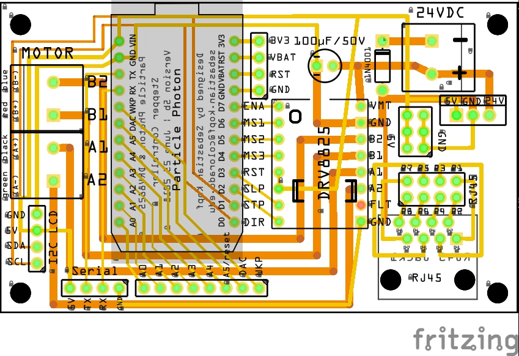

# labware_stepper_pump

## wiring diagram

 

## stepper setup: adjusting driver current limit

 - it is crucial to adjust the current limit properly to always be < the rated current/phase of the stepper motor (if too high then can damage the motor and driver, if too low won't get full torque and get the annoying scretching). The full step mode will only use 70% of this max current the driver allows but all microstepping modes will energize up to the set current limit.
 - there is a good standard tutorial on how to adjust this available here (the youtube video is extremely helpful): https://www.pololu.com/product/2133
 - in theory for the DRV8825, the reference voltage measured between logic ground and the trim pot (Vref) x 2 = resulting current limit (so e.g. for limiting current to 1A, ref in theory should be set to 0.5V)
 - in practice, however, this can vary quite a bit (maybe quality of resistors on DRV8825 board? or maybe the ref. voltage supplied by the particle photons), and it is highly advisable to actually check the current per phase once the trim pot is set (and then adjust as needed)
 - this is done most easily by adjusting the trim pot (power to the board but not running the stepper!) to the theoretical 1/2 of the max rated current/phase of the stepper, then putting the multimeter in series with one of the coils of the stepper and starting the stepper at a very low speed so you can easily watch it step the current through this coil up and down and figure out the maximum current it is running at
 - for example, for a stepper online stepper (Nema 17 planetary geared stepper) with 1.8 step angle and 5.18 gear ratio, max current per phase of 1.68A the following Vrefs resulted in the following max currents in full step and microstepping modes:
  - 406mV --> 370mA in full step,  620mA in microstepping
  - 564mV --> 540mA in full step,  860mA in microstepping
  - 696mV --> 660mA in full step, 1070mA in microstepping
  - 893mV --> 860mA in full step, 1390mA in microstepping
  - This is actually an almost perfect linearity of 1.6 instead of 2
 - NOTE: the trim pot voltage is most easily adjusted with a voltmeter attached to the screwdriver (easer with flat head than with cross)

### Watson Marlow stepper motor pump head

  - adjust to <= 1200mA in microstepping mode (Vref ~ 700mV - 800mV), make sure to check the current as described above

## particle photon setup

 - setup the [Particle Photon](https://store.particle.io/collections/photon) microcontroller (via Wifi and cell phone or via computer and command line interface), instructions in the [Particle Docs](https://docs.particle.io/guide/getting-started/start/photon/)
 - clone this repository to preferred location on your local harddrive
 - easiest use of this repository:
  - install the [Particle Interactive Development Environment](https://www.particle.io/products/development-tools/particle-desktop-ide)
  - load the cloned repository folder in the  Particle IDE
  - adjust the parameters in `pump.ino` that define the used pins and characteristics of the stepper (e.g. steps, etc.)
  - login into your particle account in the Particle IDE
  - select the Photon flash the code (lightning bolt symbol) over WIFI
  - that's it, if wired correctly you should now have full access to your pump's functionality from your local command line anywhere via the particle cloud
 - alternatively, use [build.particle.io](http://build.particle.io)
  - log in to the Particle web interface and create a new project
  - add the `AccelStepper` (and if used the `LiquidCrsytal_I2C`) libraries to your project from the online library tab
  - add the remaining `.h` and `.cpp` files in the repository to your project and upload the `.ino` file's content to the main project file
  - select the target Particle Photon and flash the program

## web commands

To run these web commands, you need to either have the [Particle Cloud command line interface (CLI)](https://github.com/spark/particle-cli) installed, or format the appropriate POST request to the [Particle Cloud API](https://docs.particle.io/reference/api/). Here only the currently implemented CLI calls are listed but they translate directly into the corresponding API requests (see `pump_control.html` file for an example implementation via javascript).

#### access via POST

Download and open the `pump_control.html` file and fill in your particle account's access token and the device name or ID. You only have access to the photons that are registered to your account.

#### requesting information via CLI

The state of the pump can be requested by calling `particle get <deviceID> state` where `<deviceID>` is the name of the photon you want to get state information from. The return value is an array string (ready to be JSON parsed) that includes information on status, speed, direction, microstepping, locked/unlocked, etc. Make sure to be logged in (`particle login`) to have access to your photons.

#### issuing commands via CLI

All calls are issued from the terminal and start with `particle call <deviceID>` where `<deviceID>` is the name of the photon you want to issue a command to. If the command was successfully received and executed `0` is returned, if the command was received but cause and error, a negative number (e.g. `-1` for generic error, `-2` for unknown command, etc.) is the return value. Positive return values mean executed with warning (e.g. `1` for generic warning, `2` means had to set to max rpm instead of requested). You can change all of the following command's exact wording and all the return codes in `PumpCommands.h` if you want them to be different. Make sure to be logged in (`particle login`) to have access to your photons.

  - `particle call pump "start"` to start the pump (at the currently set speed and microstepping)
  - `... pump "stop"` to stop the pump and disengage it (no holding torque applied)
  - `... pump "hold"` to stop the pump but hold the position (maximum holding torque)
  - `... pump "rotate <x>"` to have the pump do `<x>` rotations and then execute a `stop` commands
  - `... pump "ms <x>"` to set the microstepping mode to `<x>` (1= full step, 2 = half step, 4 = quarter step, etc.)
  - `... pump "ms auto"` to set the microstepping mode to automatic in which case the lowest step mode that the current speed allows will be automatically set
  - `... pump "speed <x> rpm"` to set the pump speed to `<x>` rotations per minute (if the pump is currently running, it will change the speed to this and keep running). if microstepping mode is in `auto` it will automatically select the appropriate microstepping mode for the selected speed. If the microstepping mode is fixed and the requested rpm exceeds the maximally possible speed for the selected mode (or if in `auto` mode, the requested rpm exceeds the fastest possible on full step mode), the maximum speed will automatically be set instead and a warning return code will be issued.
  - `... pump "direction cc"` to set the direction to counter clockwise
  - `... pump "direction cw"` to set the direction to clockwise
  - `... pump "direction switch"` to reverse the direction (note that any direction changes stops the pump if it is in `rotate <x>` mode)
  - `... pump "lock"` to lock the pump (i.e. no commands will be accepted until `unlock` is called)
  - `... pump "unlock"` to unlock the pump if it is locked
  - to be continued (more commands in progress)...
